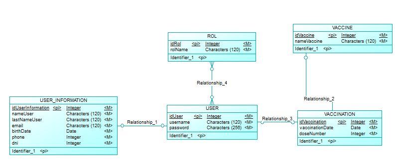

# INVENTARIO-VACUNAS

## Ejecucion ##
***
Para este proyecto se utilzo IntelliJ como IDE, ademas de gradle como el constructor de la aplicacion.
Para su ejecucion se debe:
- Clonar el proyecto
- Cargar las dependencias descritas en el archivo de   configuraciones gradle
- Cargar gradle
- Ejectuar proyecto con el boton de ejecucion de IntelliJ

## Modelo de la base de datos ##
***

